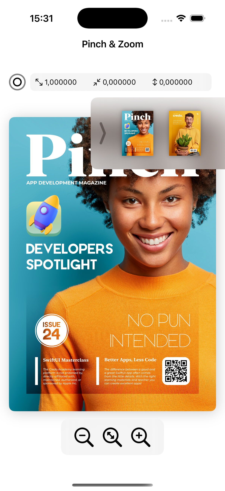

# 📱 Pinch & Zoom - SwiftUI Image Viewer

A modern iOS application built with SwiftUI that demonstrates advanced gesture handling and interactive image manipulation. This project showcases professional-grade pinch-to-zoom functionality with smooth animations and an intuitive user interface.



## ✨ Features

### Gesture Controls
- **Double Tap Gesture** - Quickly zoom in (5x) and out with a double tap
- **Pinch/Magnification Gesture** - Smooth pinch-to-zoom with scale limits (1x - 5x)
- **Drag Gesture** - Pan around the zoomed image with fluid motion
- **Long Press Gesture** - Reveal the info panel showing current scale and offset values

### User Interface Components
- **Control Interface** - Three-button control panel for precise zoom control:
  - Zoom In (+)
  - Reset to original size
  - Zoom Out (-)
- **Drawer Interface** - Slide-out thumbnail gallery for quick image switching
- **Info Panel** - Real-time display of image scale and offset coordinates
- **Smooth Animations** - Spring and linear animations for all interactions

### Image Gallery
- Magazine cover viewer with multiple pages
- Thumbnail navigation system
- Seamless image switching with animations

## 🛠 Technologies Used

- **SwiftUI** - Modern declarative UI framework
- **Swift** - Native iOS programming language
- **Gesture Recognizers** - Built-in SwiftUI gesture handling
- **State Management** - @State property wrappers for reactive UI
- **Animations** - Spring and linear animation modifiers

## 📁 Project Structure

```
SwiftUIProject5-Pinch/
├── Screen/
│   └── ContentView.swift           # Main view with gesture handling
├── View/
│   ├── InfoPanelView.swift         # Info panel showing scale/offset
│   ├── ControlImageView.swift      # Reusable control button view
│   └── SwiftUIProject5_PinchApp.swift  # App entry point
├── Model/
│   └── PageModel.swift             # Page data model
└── Data/
    └── PageData.swift              # Sample page data
```

## 🚀 Installation

### Requirements
- Xcode 15.0 or later
- iOS 17.0 or later
- macOS Ventura or later (for development)
- Swift 5.9+

### Setup Instructions

1. Clone the repository:
```bash
git clone https://github.com/yourusername/SwiftUIProject5-Pinch.git
cd SwiftUIProject5-Pinch
```

2. Open the project in Xcode:
```bash
open SwiftUIProject5-Pinch.xcodeproj
```

3. Select your target device or simulator

4. Build and run the project (⌘ + R)

## 💡 Usage

### Basic Interactions

1. **Zoom In/Out**
   - Use pinch gesture with two fingers
   - Double-tap to zoom to 5x or reset to 1x
   - Use control buttons at the bottom

2. **Pan Image**
   - Drag the zoomed image to view different areas
   - Image resets to center if scale is at 1x

3. **View Info Panel**
   - Long-press the info icon (top-left)
   - View current scale and offset values

4. **Switch Images**
   - Tap the chevron icon (top-right) to open drawer
   - Select thumbnail to switch images

## 🎯 Key Implementation Highlights

### Gesture Handling

The app implements simultaneous gesture recognition for a smooth user experience:

```swift
.gesture(DragGesture()...)
.gesture(MagnificationGesture()...)
.onTapGesture(count: 2)
```

**Location**: `ContentView.swift:57-88`

### State Management

Reactive state updates ensure UI consistency:

```swift
@State var imageScale: CGFloat = 1
@State private var imageOffset: CGSize = .zero
@State private var isDrawerOpen: Bool = false
```

**Location**: `ContentView.swift:11-14`

### Scale Constraints

Prevents over-zooming and maintains smooth interactions:

```swift
if imageScale >= 1 && imageScale <= 5 {
    imageScale = value
} else if imageScale > 5 {
    imageScale = 5
}
```

**Location**: `ContentView.swift:74-78`

### Animation System

Combines spring and linear animations for natural feel:

```swift
withAnimation(.spring()) {
    imageScale = 1
    imageOffset = .zero
}
```

**Location**: `ContentView.swift:21-24`

## 📚 Learning Objectives

This project demonstrates proficiency in:

1. **Advanced SwiftUI Gestures**
   - Implementing multiple simultaneous gestures
   - Gesture state management
   - Gesture conflict resolution

2. **State-Driven UI**
   - Reactive programming with @State
   - State-based animations
   - Computed properties for dynamic UI

3. **Custom View Components**
   - Reusable view components
   - View modifiers and overlays
   - Component composition

4. **Animation Techniques**
   - Spring animations for natural motion
   - Linear animations for smooth transitions
   - Animation timing and easing

5. **SwiftUI Layout System**
   - ZStack, HStack, VStack composition
   - Overlay and alignment
   - Responsive design patterns

## 🎓 Educational Value

Perfect for learning:
- SwiftUI gesture handling patterns
- Interactive image manipulation
- State management in SwiftUI
- Professional UI/UX design patterns
- Animation best practices

## 📝 Code Quality

- Clean, readable code with proper formatting
- Descriptive variable and function names
- Modular component architecture
- Reusable view components
- Proper separation of concerns (Model-View)

## 🔧 Customization

You can easily customize:
- Scale limits (currently 1x to 5x)
- Animation duration and style
- Control button icons and layout
- Drawer appearance and behavior
- Info panel display format

## 🐛 Known Issues

None at this time. Please report any issues you encounter.

## 🤝 Contributing

Contributions are welcome! Feel free to:
- Report bugs
- Suggest new features
- Submit pull requests
- Improve documentation

## 📄 License

This project is available for educational and personal use.

## 👤 Author

**Yaro Paul**
- Created: December 4, 2024
- Project: SwiftUI Learning Series - Project 5

## 🙏 Acknowledgments

- Built as part of SwiftUI learning curriculum
- Demonstrates iOS native gesture handling
- Showcases modern SwiftUI best practices

---

**Note**: This is an educational project demonstrating SwiftUI gesture handling and interactive UI development. The code is optimized for learning and understanding SwiftUI concepts.
